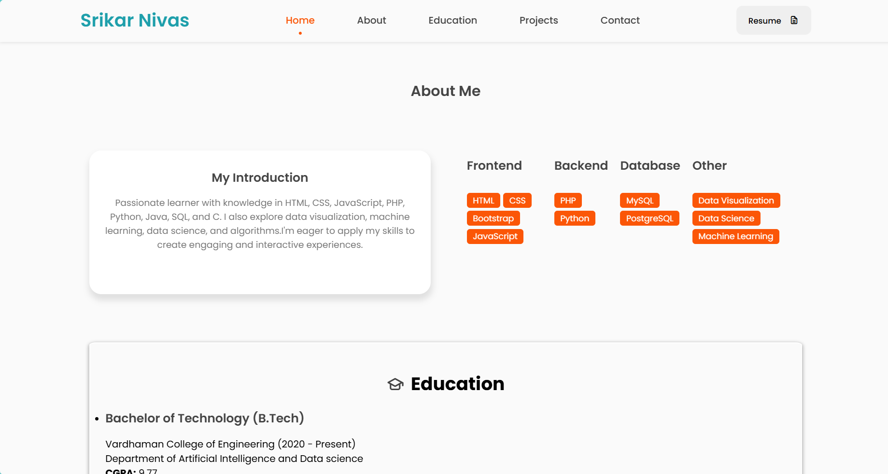
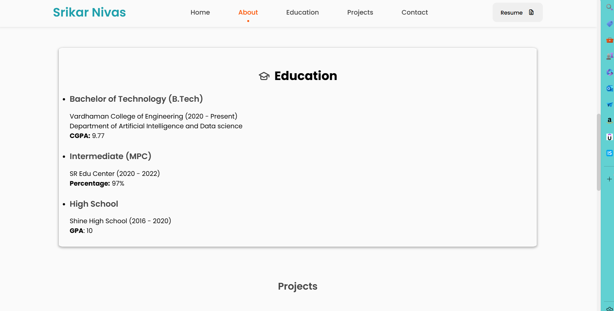

# Portfolio Website of Srikar Nivas

Welcome to the repository for the personal portfolio website of Srikar Nivas. This website showcases my skills, projects, and educational background, and serves as a central hub for potential employers, collaborators, and friends to learn more about me.

## Table of Contents
- [About](#about)
- [Features](#features)
- [Technologies Used](#technologies-used)
- [Usage](#usage)
- [Screenshots](#screenshots)
- [Contributing](#contributing)
- [License](#license)
- [Contact](#contact)

## About

This portfolio website is designed to present an overview of my professional profile, including:
- A brief introduction and overview of my skills
- Details about my education
- Highlights of my projects
- Contact information and links to my social media profiles
- An embedded Google Map showing my location

## Features

- **Responsive Design**: The website is fully responsive and works well on various devices and screen sizes.
- **Interactive Elements**: Includes interactive buttons and icons that provide a smooth user experience.
- **CV Download**: Users can download my CV directly from the website.
- **Social Media Links**: Links to my social media profiles open in a new tab.
- **Google Map Integration**: Displays my location using an embedded Google Map.

## Technologies Used

- HTML5
- CSS3
- JavaScript
- [Unicons](https://unicons.iconscout.com/)
- [Typed.js](https://github.com/mattboldt/typed.js/)
- [ScrollReveal.js](https://scrollrevealjs.org/)

## Usage

To view the portfolio website, simply clone this repository and open the `index.html` file in your web browser.

### Steps to Clone and Run

1. Clone the repository:
    ```bash
    git clone https://github.com/Srikarnivas/Portfolio.git
    ```

2. Navigate to the project directory:
    ```bash
    cd Portfolio
    ```

3. Open `index.html` in your preferred web browser:
    ```bash
    open index.html
    ```

## Screenshots
#Home section

#About section

#Education section

#Projects section

#Contact section


## Contributing

Contributions are welcome! If you have any suggestions or improvements, please create an issue or submit a pull request.

## License

This project is licensed under the MIT License

## Contact

If you have any questions or want to connect, feel free to reach out to me:

- Personal Email: srikarnivas.24@gmail.com
- Student Email: yerrasrikarnivasreddy22aids@student.vardhaman.org
- [LinkedIn](https://www.linkedin.com/in/srikar-nivas-reddy-yerra-43a10b293/)
- [GitHub](https://github.com/Srikarnivas)

Thank you for visiting my portfolio website repository!


